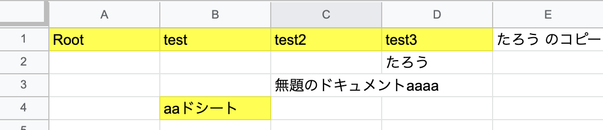

# document-management-gstool

# これは何？

Google Driveで文書管理をしている場合、文書の検索性は高いですが一覧性はよくありません。たとえば新入社員などの方が就業規則などのファイルがおいてある場所を探す場合、「就業規則」のキーワードで探すことになりますが、同ディレクトリ内に配置しているものや、上の階層、さらにその上の階層、あるいは同階層の深いところのフォルダの一覧も見たいなどがあると思います。このような作業は、いちいちGUIで処理を動かしていると途端に重たいため、　スプレッドシートに一覧化しておくことで、ファイルの置き場などの把握や、不要なファイルの存在を把握することができます。

Google Driveなどのクラウドストレージは便利な反面、ゴミが溜まりやすいです。「見える化」し、整理整頓を行い、情報を一元化できるような機構を作り上げましょう。

# 使い方

- スプレッドシートを適当な場所に配置します
- `main.gs` の中身をコピーし、スクリプトエディタに貼り付けます
- Drive API を有効化
- `TARGET_ID` に取得したいフォルダのIDを設定
- マクロを実行

実行すると、以下のように出力されます。

